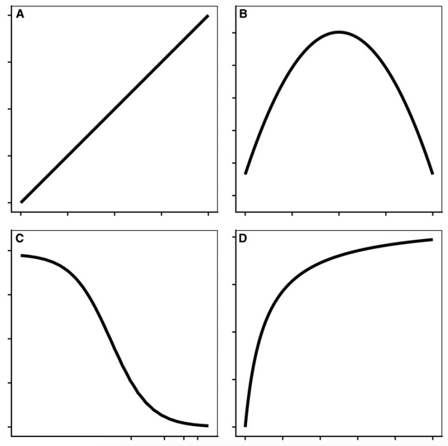
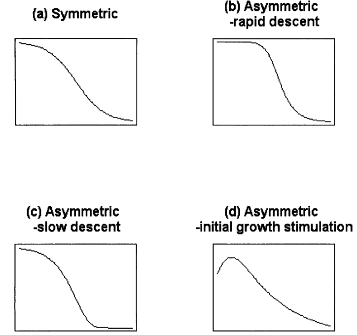

```{r include=FALSE}
library(drc)
library(tidyverse)
library(leaflet)
library(leaflet.providers)
library(leaflet.extras)
library(icons)
library(tidyUSDA)
library(plotly)
library(countdown)
```

```{r xaringan-themer, include=FALSE, warning=FALSE}
library(xaringanthemer)
style_duo_accent(
  primary_color = "#1E4D2B",
  title_slide_background_color= "#1E4D2B",
  background_color = "#FFFFFF",
  secondary_color = "#ECC530",
  inverse_header_color = "#59595B"
)
```

```{r setup, include=FALSE}
options(htmltools.dir.version = FALSE)
knitr::opts_chunk$set(
  fig.width=9, fig.height=3.5, fig.retina=3,
  out.width = "100%",
  cache = FALSE,
  echo = TRUE,
  message = FALSE, 
  warning = FALSE,
  hiline = TRUE
)
```


class: middle, center

## Maxwel Coura Oliveira


[`r icon_style(fontawesome("github"), style = "solid")` @maxwelco](https://github.com/maxwelco)  
[`r icon_style(fontawesome("twitter"), style = "solid")` @maxwelco](https://twitter.com/maxwelco)  
[`r icon_style(fontawesome("link"), style = "solid")` maxweeds.rbind.io](https://maxweeds.rbind.io)  
[`r icon_style(fontawesome("envelope-square"), style = "solid")` maxwelco@gmail.com](mailto:maxwelco@gmail.com)


---

```{r features, include=FALSE, warning=FALSE}
xaringanExtra::use_search(show_icon = TRUE,
                          position = "top-left")
xaringanExtra::use_webcam()
#xaringanExtra::use_freezeframe()
xaringanExtra::use_tile_view() # use letter O
xaringanExtra::use_share_again()
xaringanExtra::use_scribble() # use letter S
xaringanExtra::use_fit_screen()
xaringanExtra::use_broadcast() # use P
xaringanExtra::use_panelset()
```


## Anúncios

#### Ler

- Knezevic et al. (2007) - [Utilizing R Software Package for Dose-Response Studies](https://www.cambridge.org/core/journals/weed-technology/article/abs/utilizing-r-software-package-for-doseresponse-studies-the-concept-and-data-analysis/E3607D41C953BEEEB7A8B2F9D60F1C4B)

- Ritz et al. (2015) - [Dose-Response Analysis Using R](https://journals.plos.org/plosone/article?id=10.1371/journal.pone.0146021)

- Keshtkar et al. (2021) - [Perspective: common errors in dose–response analysis and how to avoid them](https://onlinelibrary.wiley.com/doi/abs/10.1002/ps.6268?casa_token=oG3pwjw1YKsAAAAA%3AQUH5c0_6Yhhtvr65wE0hGfouV_olINKwxnkB62SB7M1RaBC0n-Xw84ICh7bA-zDqrgCVceLESa17PtpF)

---

background-image: url(https://source.unsplash.com/erxoxRcdMQA)
background-position: right
background-size: contain

## Agenda


- Breve história da dose responsta

- Definição e usos
  
- Curva
  
- Paraâmetros

- Número de doses (tratamentos)

- Interpretação e análises


.footnote[Image: Jessica Fadel/Unsplash]


---

background-image: url(https://upload.wikimedia.org/wikipedia/commons/thumb/4/4a/Paracelsus.jpg/800px-Paracelsus.jpg)
background-position: right
background-size: contain

## Philippus Aureolus <br>Theophrastus <br>Bombastus von Hohenheim

#### (1493 – 24 September 1541)

--

> Alle Ding sind Gift und nichts ohn Gift. <br>Allein die
 Dosis macht das ein Ding kein Gifft ist 
<br>

--

> All things are poison and are not poison; <br>only the dose makes a thing not a poison
<br>

--

> "Todas as substâncias são venenos; não existe uma <br>que não seja veneno. A dose certa diferencia um <br>veneno de um remédio"


**Paracelsus**, o "pai da toxicologia"


.footnote[Image: Wikipedia]

---

## Dose response

#### Definition

> A relação dose-resposta descreve a magnitude da resposta de um organismo, em função da exposição (ou doses) a um estímulo ou estressor (geralmente um produto químico) após um determinado tempo de exposição.
--

#### Aplicações

- Toxicologia

- Farmacologia

- Epidemiologia

- Biologia
    - Ciência da planta daninha


---

## Dose responsta

#### Ciência da planta daninha

.pull-left[
- A resposta de plantas daninhas e culturas a estímulos físicos, químicos, biológicos ou temporais
  - **Resposta à dose de herbicida**
  - Período crítico para o manejo de plantas daninhas
  - Germinação cumulativa de plantas daninhas


- Resultados de ensaios biológicos requerem o uso de modelos de **regressão não linear** com limites _superior_ e _inferior_, que fornecem informações sobre a dose necessária para controlar as espécies vegetais de interesse
]

.pull-right[
<center>

</center>
]

.footnote[Image: CSU]


---

## A curva de dose responsta

> Uma **curva dose-resposta** é um gráfico de coordenadas que relaciona a magnitude de uma dose (estímulo) à resposta de um sistema biológico
--

#### Qual curva melhor descreve uma relação dose-resposta?

<center>

</center>


```{r echo = FALSE}
countdown(minutes = 0, seconds = 30)
```

---

## A curva de dose responsta

#### Equação

O modelo mais comumente usado para curvas dose-resposta é o modelo log-logístico com 3 - 4 parâmetros

<br>

.pull-left[

$$
Y = c + \frac{d-c}{1 + exp[b(logx - loge)]}
$$
]

.pull-right[
- Limite superior, d

- Limite inferior, c

- Ponto de infleção, e

- Inclinação, b
]


---

## A curva de dose responsta

.pull-left[
#### Paraâmetros

- Limite superior, d

- Limite inferior, c

- Ponto de infleção, e

- Inclinação, b
]


.pull-right[
```{r message = FALSE, warning = FALSE, echo = FALSE, fig.align='center', out.width='70%', fig.height = 6, fig.width = 6}
dose <- 1:2
resp <- rnorm(length(dose))
# no need to set the seed for the random number generation!
m <- drm(resp ~ dose, fct = LL.5())
plot(m)
```
]


---

## A curva de dose responsta

<center>

</center>

.footnote[Fonte: Knezevic et al. 2007]

---

## Typical data variables

- Biomassa (g) ou Biomassa relativa (%)

- % de controle de plantas daninhas

- Dose do herbicida (g ha<sup>-1</sup> or L ha<sup>-1</sup>)

--

<br><br>

#### Qual é a melhor variável para descrever estudos de dose-resposta?

A) peso, g

B) percentagem, %

```{r echo = FALSE}
countdown(minutes = 0, seconds = 30)
```

---

## Number of data points

- The shape of the dose response curve is influenced by the distribution of the data it describes

- Selection of herbicide doses is critical

```{r message = FALSE, warning = FALSE, echo = FALSE, fig.align='center', out.width='40%', fig.height = 6, fig.width = 6}
dose <- 1:2
resp <- rnorm(length(dose))
# no need to set the seed for the random number generation!
m <- drm(resp ~ dose, fct = LL.5())
plot(m)
```

---

## Dose response analysis

.panelset[
.panel[.panel-name[Dataset]
```{r}
library(RCurl)
library(tidyverse)
df_path <- getURL("https://raw.githubusercontent.com/maxwelco/workshop-esalq/main/data/dose_resposta.csv")
dose <- read_csv(df_path)
dose
```
]


.panel[.panel-name[Model and parameters]


```{r}
model <- drm(biomass ~ # response variable
               rate, # explanatory variable
             biotype, # treatments
             fct = W1.3(), # equation
             data = dose) # datase
summary(model)
plot(model)
```

]
.panel[.panel-name[Plot]
<center>

</center>
]

]


---

## Take home message

- Dose response relationship is best describe with a sigmoid curve and log-logistic models

- Selection of herbicide doses is critical

- Dose response uses in herbicide-weed research
    - Herbicide efficacy
    
    - Herbicide resistance
    
    - Crop tolerance

- Model parameters should have biological meaning

- Dose response can be performed using **R**, SAS or other statistical software


---

name: goodbye
class: right, middle, blue


# Thank you!

#### You can find me at...

[`r icon_style(fontawesome("github"), style = "solid")` @maxwelco](https://github.com/maxwelco)  
[`r icon_style(fontawesome("twitter"), style = "solid")` @maxwelco](https://twitter.com/maxwelco)  
[`r icon_style(fontawesome("link"), style = "solid")` maxweeds.rbind.io](https://maxweeds.rbind.io)  
[`r icon_style(fontawesome("envelope-square"), style = "solid")` maxwelco@gmail.com](mailto:maxwelco@gmail.com)
